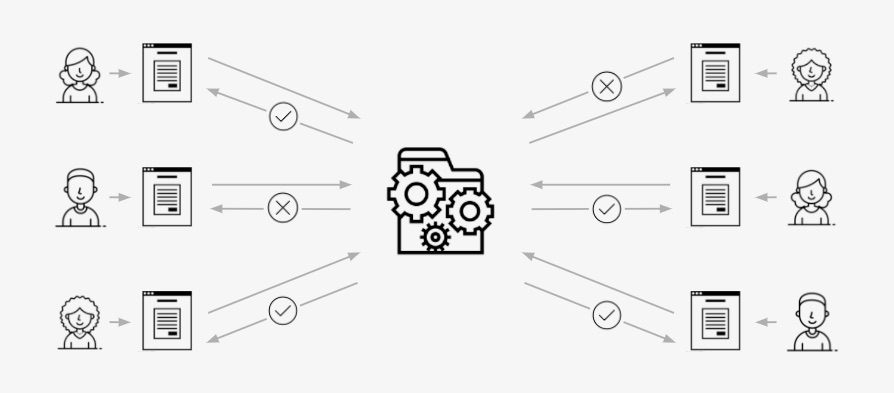

# Helping states turn federal eligibility policy into action

## Project description

#### The [Eligibility APIs Initiative](#project-description) (formerly the Eligibility Rules Service) is exploring how federal eligibility-based programs could use a centralized web service——an eligibility API——to deliver machine-readable policy that state systems can ingest, utilize, and act on.

In this new model, policy changes made at the federal level would propagate out to states, including state implementation variations, rather than states each having to undertake a costly, redundant, time-consuming, error-prone process to update their systems individually.

After having shown the feasibility of this approach in [two prior phases](#What-weve-done-so-far), **we are now [seeking three new partner programs](#were-seeking-new-partners)(or program sub-types)**. We want to partner at the federal and state levels to understand the unique challenges of the program and to learn how to make this model viable across the wide variety of eligibility-based scenarios.

### What we believe this model can achieve

- **Cost-efficiency:** A federally-built API that can deliver eligibility rules to many state systems at once dramatically reduces the complexity and cost of building and maintaining state systems, because those systems no longer need to build or maintain eligibility rules in a rules engine product.

- **Transparency:** Because the eligibility rules are written in publicly-available code, anybody can view them and confirm that systems are behaving as expected. There's no "black box" where eligibility criteria are hidden away; instead, the programatic rules are open to public review.

- **Modularity:** Centralizing eligibility business logic at the federal level provides more flexibility and reduces risk for states who need to modernize their benefits systems. Instead of modernizing an entire massive system in a large risky project, states can strategically disconnect and reconnect pieces of the system gradually, significantly reducing their risk.

- **Innovation:** An API is a technique that is widely used within modern digital service design to provide controlled, secure, flexible access to a system's data. Using an API to deliver eligibility rules would create an open canvas for creative technologists and civil servants to come up with exciting and powerful ideas to serve the public that we haven't even thought of yet.

- **Integrity:** In this model, program eligibility rules are centrally maintained the Eligibility API at the federal level. If rules or policy change, those changes can be made at the API level and will propagate out to all connected states automatically. This greatly reduces the risk of state systems being out of sync with federal rules.

### What we've done so far

Through two projects, we have collaborated with federal and state staff to build two proofs-of-concept for the WIC and D-SNAP programs. This work has validated the technical concerns around building Eligibility APIs, with most of our focus now on program applicability and state integrations.

| Stage | Description | Repo | API | Form |
| :---: | :---- | :---: | :---: | :---: |
| **Alpha, pending Beta** | For our second project, we developed an Eligibility API for Disaster Supplemental Nutrition Assistance Program (D-SNAP) as well as an online Regististration App that uses the API. This is ongoing pending approval to proceed to the Beta stage | [Repo](https://github.com/18F/dsnap_rules) | [API](https://github.com/18F/dsnap_rules#development) | [Registration App](https://dsnap-rules.app.cloud.gov/) |
| **Discovery** | For our first project, we developed a prototype Eligibility API for The Special Supplemental Nutrition Program for Women, Infants, and Children (WIC). This work allowed us to show that we could accommodate varied state policy options into a single Eligibility API ruleset. (Note: The prototype is for demonstration purposes only and is not an official interpretation of policy.) | [Repo](https://github.com/18F/wic_rules) | [API](https://github.com/18F/wic_rules#using-the-api) | [Demo form](https://eligibility-rules-form.fr.cloud.gov/) |

## We\'re seeking new partners

If you're part of a Federal human/social services agency, we're interested in talking with you about your Eligibility & Enrollment system(s), IT modernization plans, and general program eligibility determination methods.

Our partnerships have been critical to our current understanding of how eligibility policy works, and we want to partner with other agencies to learn about their unique situations and make sure our solution works for them, too.

### What does partnership entail?

**DISCOVERY/ - I think we could indicate we're looking for Discovery stage partners, briefly describe the stage work in a sentence or so, mention it would involve allocating time to collaboration, and aside from that, not cost to the partner.**
We're funded to do this exploration through [10x](https://10x.gsa.gov), so there's no financial component to partnering with us - all we need is your time and commitment to helping us better understand how eligibility policy works in your program. Based on our past partnerships this has amounted to approximately **40-60 total hours from a policy point of contact, and a handful of hours from other subject matter experts, over 8-10 weeks of calendar time**.

**THIS FEELS LIKE IT"S GOING A BIT FAR - I'd be less specific. I think this will scare folks. It's a little too "Let's go on a date. If it all works out we can get married and have 3 kids and live near my parents."**
If our partnership suggests that an eligibility API could make an impact for your program, we can then work together to outline and plan subsequent phases of work (which *would* require funding from your agency) to build a tool, like those we built in partnership with WIC and D-SNAP, for your agency. We would then seek to test the tool in a real-world scenario, and eventually, go live - with your team in close partnership throughout, and eventually taking full ownership of the new solution.

## Want to know more?

- Read our [weekly recaps](https://github.com/18F/eligibility-rules-service/wiki/Weekly-recaps#phase-3---october-1-2018-to-present)
- "Watch" or "star" the repo above
- Read our blog posts [Implementing rules without a rules engine](https://18f.gsa.gov/2018/10/09/implementing-rules-without-rules-engines/) and [Exploring a new way to make eligibility rules easier to implement](https://18f.gsa.gov/2018/10/16/exploring-a-new-way-to-make-eligibility-rules-easier-to-implement/)
- Email us at eligibility.rules.service@gsa.gov - we're always happy to speak with similarly-interested people!

#### The problem

Many states struggle to modernize their human services eligibility and enrollment systems due to the variation and complexity of the policy rules that determine eligibility for federally funded programs, as well as outdated, monolithic procurement and development practices, limited reusable components, and scarce resources. These efforts lead to duplicative work and expense across states without delivering better service.

> View presentation [What is the Eligibility Rules Service project?](assets/what-is-the-eligibility-rules-service-project.pdf)

#### Our hypothesis

Both federal and state agencies could achieve greater program efficiencies if the administering federal agency offered a configurable, API-based service that allowed state partners to make eligibility determinations, rather than building and maintaining their own separate rules engines.

We hypothesize that creating a new rules service could help shift the space towards increased modularity, reuse of shared services, and adoption of modern, open source technologies, by providing an easier, faster, and less expensive way to integrate eligibility & enrollment across programs. It could also complement [a similar service](https://www.medicaideligibilityapi.org/#/application) that already exists for Medicaid. In addition to having immediate benefit for a number of state human services agencies and millions of people, we also hypothesize that this rules service could function as an example to any federal agency looking to deliver policy through working, reusable code, rather than PDFs that require duplicative development for each implementation.

> **Project Updates** 
> - Phase 3 is in progress. We're working with a new program exploring state system integration.
> - Read our [weekly recaps](https://github.com/18F/eligibility-rules-service/wiki/Weekly-recaps#phase-3---october-1-2018-to-present)
> - "Watch" or "star" the repo above
> - Read our blog posts [Implementing rules without a rules engine](https://18f.gsa.gov/2018/10/09/implementing-rules-without-rules-engines/) and [Exploring a new way to make eligibility rules easier to implement](https://18f.gsa.gov/2018/10/16/exploring-a-new-way-to-make-eligibility-rules-easier-to-implement/)
> - We're seeking additional partners. [Here's what we're looking for.](lets-talk.md)
> - Email us at eligibility.rules.service@gsa.gov

#### Where we are now

The following table describes our loose plan for exploring and building this concept. **We are currently in Phase 3.** These phases align with the funding structure we are using to pursue this work.

| Phase | Goals |
| ------------- | ------------- |
| 1. Focus  | Identify project for further exploration; work out TTS's role in eligibility |
| 2. Research  | Develop a product strategy for an eligibility rules service |
| 3. Build  | Build and pilot a web-based rules service for a single program |
| 4. Operate  | Operationalize the rules service |
| 5. Extend  | Extend lessons learned beyond this first rules service; move the eligibility ecosystems towards more loosely coupled, distributed and shared systems |

#### Where we've been

Further information on the work we've done during this and the previous phase can be found [in the project wiki](https://github.com/18F/eligibility-rules-service/wiki).

## To be validated

#### :white_check_mark: _Validated (Phase 1):_ TTS has a role to play in the eligibility space
TTS is in a unique position to be a leader, influencing the ecosystem and its actors from a variety of angles due to our ability to work with agencies across the federal government, our experience supporting states through procurement consulting, our ongoing engagement with the vendor community, and our ability to build products and platforms for use across government. _See [Phase 1 Recommendations (Longform)](https://github.com/18F/eligibility-rules-service/wiki/Phase-1-Recommendations-:-Longform)_

#### :white_check_mark: _Validated:_ A finite piece of work appropriate to TTS can be identified
We hypothesize that the highest-value area for TTS to explore further is investigating the value and feasibility of building an API-based eligibility rules web service for a non-MAGI Medicaid human services program, to help federal human service agencies facilitate the adoption of multi-benefit eligibility determination. _See [Phase 1 Conclusions (Pitch)](https://github.com/18F/eligibility-rules-service/wiki/Phase-1-Recommendations-:-Pitch)_

#### :white_check_mark: _Validated:_ Partners will want to collaborate with us to make this happen
Through a series of conversations with potential partners at CMS and FNS, we’ve validated that there are indeed interested partners at the federal level. Through all of these conversations, the general concept resonated and potential use cases were identifiable.

#### :white_check_mark: _Validated:_ States will want to collaborate with us to make this happen
We have identified one state program interested in working with us going forward. While we still intend to identify one or two others, through conversations with states and FNS regional program specialists, we feel confident that problem we are working to address is broadly applicable and that we'll be able to find those partners.  

#### :white_check_mark: _Validated:_ Building or repurposing a rules service is technologically advisable
The level of effort in building out a rules service turned out to be less than anticipated. Our prototype functionality approximated the what we'd anticipate an MVP needing. As such, the effort associated with building a rules service from scratch is low enough to make repurposing an existing system unneccessary.

#### :white_check_mark: _Validated:_ A rules service can be built that allows multiple states with varying eligibility rules to use it
Building off of lessons learned from [MAGI in the Cloud](https://www.medicaideligibilityapi.org/#/application), we wanted to validate we could build a rules service that would accommodate a program where state policies vary considerably. WIC varies both in the income standard which follows the USDA's reduced price school lunch guidelines as well as the policy options implemented at the state level. Our prototype solves for both scenario.

#### :white_check_mark: _Validated:_ TTS's current strategy and direction is aligned with pursuing an effort like this
After presenting our Phase 2 conclusions to the TTS 10x review board, the group that evaluates whether our work is meeting it's objectives and whether it should continue, we were approved to proceed to Phase 3, validating that TTS finds this work valuable and is the kind of work we should be doing.

#### :white_circle: Interested states have technical pathways to adopting a web service-based approach to rules
_Not yet validated - Phase 3_

#### :white_circle: An eligibility rules service offers a faster and cheaper way for states implement rules in their systems
_Not yet validated - Phase 4_

## How can you help?

**State human/social services agencies**

If you are part of a state human/social services agency, we're interested in talking with you about your Eligibility & Enrollment system(s), IT modernization plans, and general program eligibility determination methods.

[File an issue](https://github.com/18F/eligibility-rules-service-exemplar-research/issues) or email us at eligibility.rules.service@gsa.gov

**Non-gov organization**

If you work with an organization outside of government and you have a use case for such a service, we're interested in talking with you.

[File an issue](https://github.com/18F/eligibility-rules-service-exemplar-research/issues) or email us at eligibility.rules.service@gsa.gov

## Weekly progress updates

During active phases, we post [weekly recaps](https://github.com/18F/eligibility-rules-service/wiki/Weekly-recaps) of our work for folks interested in following along with our progress.
